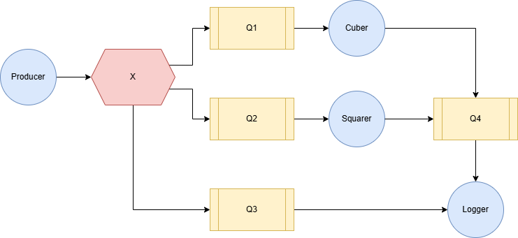

[](https://classroom.github.com/a/mKvFacjx)
# Week 3 - Message Brokers

> Distributed and Networking Programming - Spring 2025

Your task for this lab is to use [RabbitMQ](https://rabbitmq.com/) as a message broker for the system on the picture:



1. **Yellow rectangles** - Queues. Transfer messages between applications
2. **Blue circles** - Applications.
    1. Producer
    2. Squarer
    3. Cuber
    4. Logger
3. **Red hexagon** - Fanout Exchange. Pushes a copy of incoming messages to queues


## Applications
### Producer
* Connect to RabbitMQ using the global credentials
* Declare a proper exchange type
* Publish messages
* Make messages persistent
* Include proper error handling

### Squarer/Cuber
* Connect to RabbitMQ
* Consume from the exchange
* Calculate squares/cubes of received numbers
* Publish results to another queue
* Implement proper message acknowledgment

### Logger
* Consume from both original numbers and processed queues
* Write log entries to rabbitmq_messages.log in format of `[{ISOtimestamp}] {publisher_name_of_producer} : {message_type}} : {number}`
Example of log file:
```
=== Log started at 2025-04-06T12:10:42.246604 ===
[2025-04-06T12:10:43.251939] test1 : original : 0
[2025-04-06T12:10:43.252208] test1 : original : 1
[2025-04-06T12:10:43.252318] test1 : original : 2
[2025-04-06T12:10:43.252476] test1 : squared : 0
[2025-04-06T12:10:43.252590] test1 : cubed : 0
[2025-04-06T12:10:43.252719] test1 : original : 3
[2025-04-06T12:10:43.252850] test1 : cubed : 1
[2025-04-06T12:10:43.252927] test1 : squared : 1
[2025-04-06T12:10:43.253035] test1 : original : 4
[2025-04-06T12:10:43.253150] test1 : cubed : 8
[2025-04-06T12:10:43.253227] test1 : original : 5
[2025-04-06T12:10:43.253365] test1 : squared : 4
[2025-04-06T12:10:43.253443] test1 : cubed : 27
[2025-04-06T12:10:43.253552] test1 : cubed : 64
[2025-04-06T12:10:43.253663] test1 : squared : 9
[2025-04-06T12:10:43.253734] test1 : cubed : 125
[2025-04-06T12:10:43.253839] test1 : squared : 16
[2025-04-06T12:10:43.253910] test1 : squared : 25
```

## Checklist and Grading Criteria

Submitted solution should satisfy the requirements listed below. Failing to satisfy an item will result in partial grade deduction or an assignment failure (depending on the severity).

- [ ] Required files are pushed to classrooms repository on time. Other files are not modified.
  - [ ] `applications/Producer.py`
  - [ ] `applications/Cuber.py`
  - [ ] `applications/Squarer.py`
  - [ ] `applications/Logger.py`

- [ ] Code runs successfully under the [latest stable Python interpreter](https://www.python.org/downloads/)
- [ ] Code only imports dependencies from the [Python standard library](https://docs.python.org/3/library/index.html) and pika

The list may not be fully complete. We preserve the right to deduct points for any other non-listed issues.
